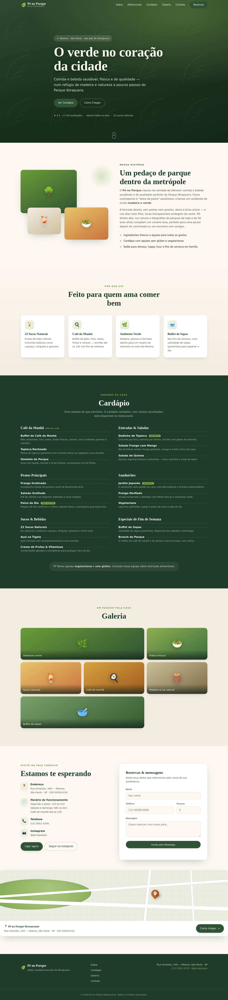

# 🌿 Pé no Parque Restaurante — Site

Site institucional (landing page) do **Pé no Parque Restaurante**, em Moema, São Paulo —
comida e bebida saudável de qualidade aos pés do Parque Ibirapuera.

Página única, **100% estática** (HTML, CSS e JavaScript puro), responsiva e sem
dependências de build. Pode ser hospedada em qualquer lugar (GitHub Pages, Netlify,
Vercel, ou um servidor de arquivos simples).



<sub>Prévias em <a href="screenshots/">screenshots/</a> — desktop, mobile e seção de contato.</sub>

## ✨ Seções

- **Hero** — apresentação e chamadas para ação
- **Sobre** — a história e o conceito do restaurante
- **Diferenciais** — sucos naturais, café da manhã, ambiente verde, buffet de sopas
- **Cardápio** — destaques organizados por categoria
- **Galeria** — vitrine visual do ambiente e dos pratos
- **Contato** — endereço, horários, telefone, Instagram, mapa e formulário (envia via WhatsApp)

## 📍 Informações do restaurante

| | |
|---|---|
| **Endereço** | Rua Inhambu, 240 — Moema, São Paulo - SP · CEP 04520-010 |
| **Telefone** | (11) 5051-3376 |
| **Horário** | Seg a Sex: 11h–01h · Sáb e Dom: 08h–01h (café da manhã até as 13h) |
| **Instagram** | [@penoparque](https://www.instagram.com/penoparque/) |

## 🗂️ Estrutura

```
.
├── index.html        # Página principal
├── css/
│   └── style.css     # Estilos (tema natureza/verde, responsivo)
├── js/
│   └── main.js       # Menu mobile, animações, formulário → WhatsApp
├── assets/           # (reservado para imagens reais futuras)
├── screenshots/      # Prévias do site (desktop, mobile, contato)
└── README.md
```

## ▶️ Como visualizar localmente

Basta abrir o `index.html` no navegador. Para usar um servidor local:

```bash
# Python 3
python3 -m http.server 8000
# depois acesse http://localhost:8000
```

## 🛠️ Personalização rápida

- **Cores e fontes:** variáveis CSS no topo de `css/style.css` (`:root`).
- **Telefone do WhatsApp:** constante `WHATSAPP` em `js/main.js`.
- **Fotos reais:** substitua os blocos ilustrativos (emoji/gradiente) das seções
  *Sobre* e *Galeria* por `` apontando para arquivos em `assets/`.

## ℹ️ Observações

- As informações foram reunidas de fontes públicas (BaresSP, Restaurant Guru,
  Tripadvisor, iFood, Foursquare, Instagram). **Confirme valores e horários
  atualizados com o restaurante** antes de publicar oficialmente.
- O cardápio é apresentado sem preços; os valores atualizados ficam disponíveis no local.
- As imagens são representações ilustrativas (ícones/gradientes) e podem ser
  trocadas por fotografias reais do restaurante.

---

Feito com 💚 para o Pé no Parque.
